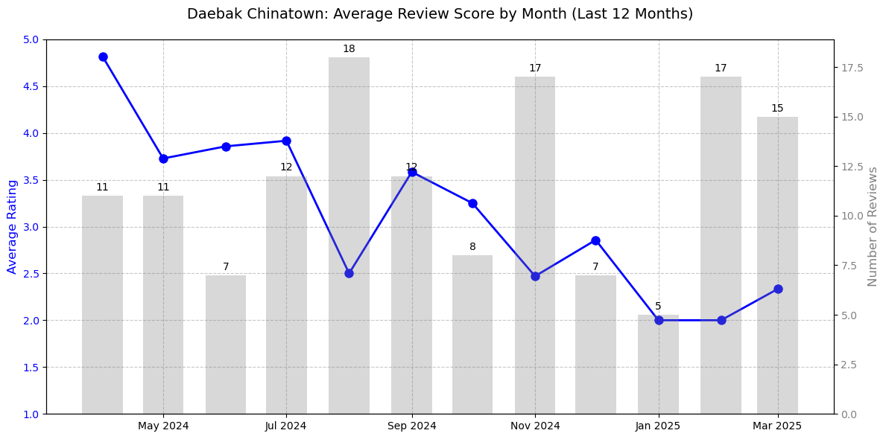

# Google Maps Reviews Tracker

A Python tool for scraping and analyzing the trend of Google Maps reviews for any location - just provide the url! After scraping the reviews and storing to a CSV file, the code also plots the average reviews over the past year.

This tool was inspired by my personal experience, where I was shocked and disappointed following a recent visit to a favorite restaurant in March 2025. I wanted to know when the restaurant started to go downhill, and decided to use Google Maps reviews to quantify the trend over the past year.




## Features

- Scrape reviews from any Google Maps location URL
- Sort reviews by newest first
- Extract ratings and timestamps
- Convert relative time texts (e.g., "2 days ago") to exact timestamps
- Save results to CSV for further analysis. If CSV already exists, can simply load CSV instead of scraping again.
- Generate a monthly review trend plot showing:
  - Average rating by month
  - Number of reviews per month

## Installation

1. Clone this repository:
```bash
git clone <repository-url>
cd google_maps_reviews_tracker
```

2. Install the required dependencies:
```bash
pip install pandas selenium webdriver-manager matplotlib
```

## Usage

### Command Line Interface

The script can be used directly from the command line:

```
python maps_review_scraper.py --url <google-maps-url> [options]
```

#### Options:

- `--url`, `-u`: Google Maps URL to scrape reviews from
- `--output`, `-o`: Output CSV file path (default: reviews.csv)
- `--max-reviews`, `-m`: Maximum number of reviews to scrape (default: all available)
- `--wait-time`, `-w`: Time to wait between scrolls in seconds (default: 10)
- `--plot`, `-p`: Generate a plot of average reviews by month
- `--plot-output`: Path to save the plot image (default: reviews_by_month.png)
- `--load-reviews`, `-l`: Load reviews from existing CSV instead of scraping

### Example Usage

#### Scrape Reviews and Generate Plot

```
python maps_review_scraper.py --url "https://maps.app.goo.gl/aJCRiy3C5gtoBZpJ7" --max-reviews 300 --wait-time 12 --plot
```

#### Load Existing Reviews and Generate Plot

```
python maps_review_scraper.py --load-reviews reviews.csv --plot
```

### Using the Example Script

An example script is provided to demonstrate usage:

```
python example.py --mode scrape  # Scrape new reviews
```

or

```
python example.py --mode load --input-file reviews.csv  # Load existing reviews
```

## Programmatic Usage

You can also use the script as a module in your own Python code:

```python
from maps_review_scraper import scrape_reviews, plot_reviews_by_month

# Scrape reviews
reviews_df = scrape_reviews(
    url="https://maps.app.goo.gl/aJCRiy3C5gtoBZpJ7", 
    max_reviews=300,
    wait_time=12
)

# Save to CSV
reviews_df.to_csv("reviews.csv", index=False)

# Generate plot
plot_reviews_by_month(reviews_df, output_path="monthly_trend.png")
```

## Customization

- Adjust the `wait_time` parameter to control scroll speed (higher value for slower connections)
- Set `max_reviews` to limit the number of reviews scraped
- Customize the plot appearance by modifying the `plot_reviews_by_month` function

## Notes

- The script uses a headless Chrome browser via Selenium
- Review timestamps are estimates based on the relative time text
- The scraper handles pagination by scrolling down to load more reviews
- For large numbers of reviews, the scraping process may take some time

## License

[MIT License](LICENSE) 
